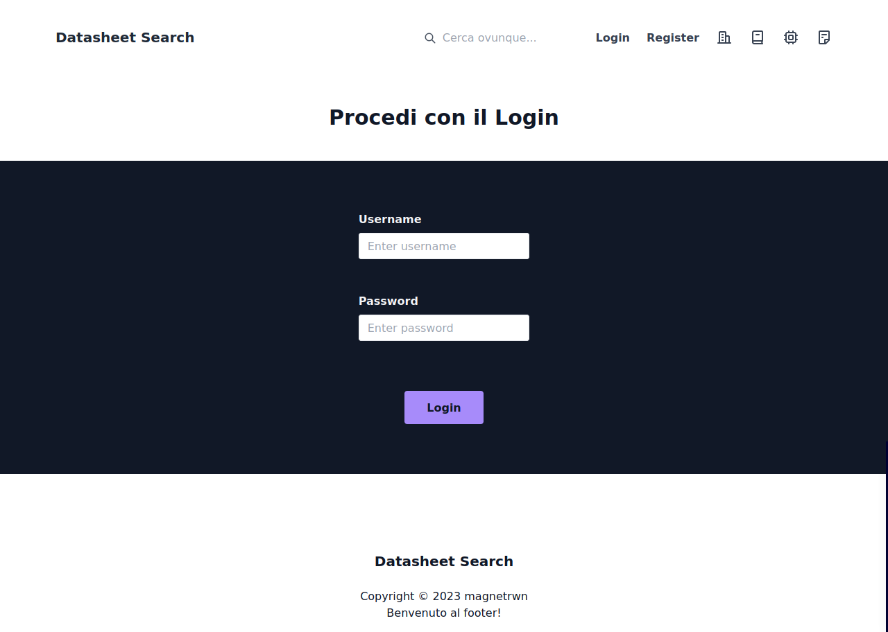
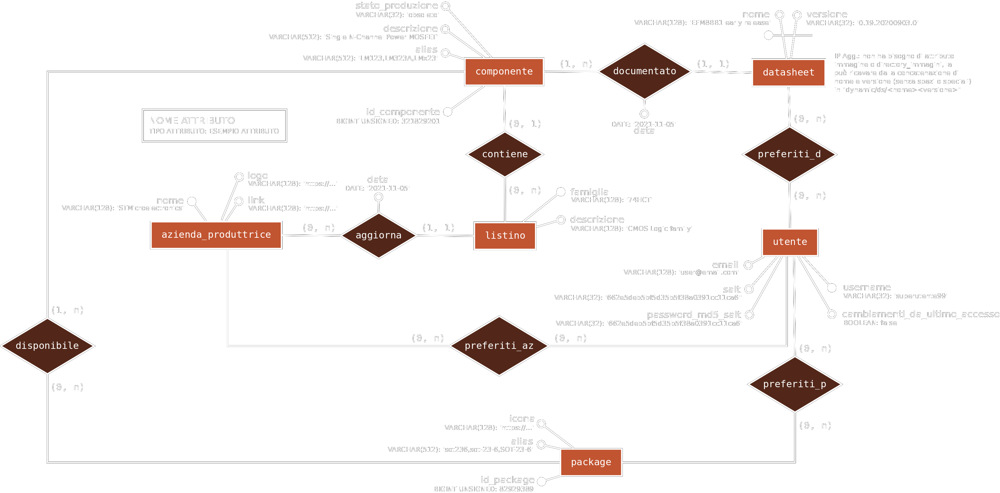

# Datasheet Search

Datasheet Search è un'applicazione web sviluppata per l'anno V 2022/2023. Seguendo il pattern MVC (Model View Controller), la web app finale è in grado di:
+ Comporre pagine dinamicamente partendo da controller (`index.php`, `ajax.php`)
+ Permettere agli utilizzatori di registrarsi come utenti, con verifiche sulla preesistenza di nomi utente, indirizzi mail e della qualità delle password inserite
+ Permettere agli utenti registrati di effettuare il login e logout
+ Attuare misure di sicurezza nei confronti degli input di utenti e visitatori di tutte le pagine della web app
+ Visualizzare il contenuto totale delle tabelle del database rilevanti agli utenti loggati
+ Permettere la ricerca di datasheet, listini e componenti da un UI facile da utilizzare
+ Permettere la aggiunta ai preferiti di certe categorie di contenuto, che devono apparire prima nei risultati
+ ... WORK IN PROGRESS ...

Il concetto base della web app è di <u>fornire informazioni relative a componenti elettronici in modo rapido tramite una barra di ricerca ed un raccoglimento dei risultati ben definito.</u> La funzionalità di ricerca potrebbe richiedere l'implementazione di uno stemmer e dell'algoritmo di TF-IDF.

### Autenticazione
Gli utenti sono salvati in un database come una tupla di:
+ Nome utente (`username`)
+ Indirizzo mail (`email`)
+ Hash MD5 della concatenazione della password ed una stringa di salt (`password_md5_salt`)
+ Stringa di salt (`salt`)
+ Un indicatore di nuove notifiche per l'utente (`cambiamenti_da_ultimo_accesso`)

Il login degli utenti consiste in due query SELECT prima per ricevere il salt e poi, dopo aver calcolato l'hash MD5 della password inviata dall'utente concatenata al salt, per confrontare l'hash salvata nel database con quella calcolata.

Nonostante salted MD5 sia un metodo insicuro di preservare i dati di autenticazione degli utenti, in questa web app si implementa a solo scopo didattico. Un metodo interessante oltre che più sicuro consiste nella libreria bcrypt, ampiamente utilizzata.

### ID Sessione
La web app genera un ID di sessione, `dssessionid`, in modo diverso dal generatore di cookie ID sessione di PHP. Il nuovo session ID è di una lunghezza di 64 caratteri:
+ I primi 32 caratteri sono generati dal calcolo dell'hash MD5 di `$_SERVER['REMOTE_ADDR']`, generando quindi lo stesso valore per gli utenti provenienti da un socket con destinazione remota uguale
+ Gli ultimi 32 caratteri sono generati casualmente con `openssl_random_pseudo_bytes()`, permettendo la connessione da uno stesso indirizzo remoto di più utenti per la diversa parte finale dell'ID sessione

È applicato un meccanismo di verifica della provenienza dell'indirizzo remoto: ad ogni cambio di pagina viene controllato se l'indirizzo del client corrisponde, sottoposto ad hash MD5, ai primi 32 caratteri del session ID (presi dal cookie del client), terminando la sessione in caso di differenza. Dato che sarebbe necessario cambiare il session ID per continuare su un socket diverso, la sessione terminerebbe in ogni caso.

### Ricerca
TODO: immagine ricerca qui

Le componenti principali della ricerca sono:
+ Model
    + `model/util-search.php`
+ View
    + `view/search/page-autolist.php`, una pagina in grado di generare tabelle visualizzabili a partire solo dal loro nome usando `model/util-search.php`, che sfrutta altri processi di eliminazione di tabelle ad esclusivo uso interno, contenuti in `model/util-db.php`
    + `view/search/page-result-block.php`, un singolo blocco di risultato ottenuto dalla ricerca
    + `view/search/page-search-bar.html`, che descrive solo la costruzione della barra di ricerca (un form html)
    + `view/search/page-search.php`, contenuto della pagina di ricerca vera e propria

... WORK IN PROGRESS ...

### Database
Il seguente è lo schema ER della base di dati allo stato più recente (immagine dark mode).

La base di dati è stata sviluppata per l'utilizzo su MySQL/MariaDB (versione non verificata).

La base di dati include le seguenti tabelle:
+ Tabelle senza chiavi esterne
    + `utente`, la tabella contenente le informazioni degli utenti per l'autenticazione
    + `package`, comprendente i diversi formati fisici di circuiti integrati
+ Tabelle con chiavi esterne
    + `azienda_produttrice`, che include le aziende produttrici di IC
    + `listino`, che descrive il nome della famiglia alla quale appartengono un gruppo di IC, solitamente con nome e specifiche simili
    + `componente`, tabella indicativa di un singolo IC
    + `datasheet`, che include i riferimenti ad ogni singolo documento, la sua versione e la sua appartenenza ad un componente (chiave primaria composta)
+ Tabelle da associazioni molti a molti
    + `preferiti_d`, `preferiti_az`, `preferiti_p`, rispettivamente i datasheet, aziende e package preferiti dagli utenti

### Tailwind CSS
Lo stile grafico utilizzato dall'intera web app si basa completamente sulle funzionalità fornite da [Tailwind CSS](https://tailwindcss.com/), che implementa lo stile degli elementi HTML tramite l'uso di classi prestabilite.

Nella web app ogni pagina costruita da `index.php` contiene il tag script necessario per avviare la libreria utilizzando la sua versione JS PlayCDN. Lo script è collocato in `view/using/tailwindcss-script.html`. La versione finale della web app utilizzerà un metodo adeguato per inserire la libreria.

Una volta terminato lo sviluppo della grafica della web app, sarebbe corretto smettere di applicare le classi di Tailwind dal suo CDN (pesante, inserisce tutte le classi e non solo quelle utilizzate), installare la versione standalone e successivamente compilare tutti i file che utilizzano Tailwind in CSS finale, in modo da avere una grafica responsive salvata localmente. Questa operazione sarebbe da effettuare una sola volta.

### Security
La web app utilizza procedure standard per la sicurezza, tra cui:
+ Utilizzo di controller per l'accesso indiretto alle risorse (accesso diretto disabilitato dal web server)
+ MD5 Rainbow Tables: salt applicato alle password (32 caratteri esadecimali)
+ PHP Code Injection: `htmlspecialchars()`, `filter_var()`
+ PHP Timing Attack: `hash_equals()`
+ SQL Injection: `mysqli_real_escape_string()`
+ Session hijacking: sono presenti meccanismi di generazione e controllo dell'ID sessione (creato in modo diverso da `PHPSESSID`) in `model/mgmt-session.php`
+ (WORK IN PROGRESS) Verifica del register con una mail contenente codice di verifica, con timeout 120 minuti
+ ... WORK IN PROGRESS ...

La generazione di gran parte di valori casuali nella web app, come nella generazione del salt o ID sessione, utilizza la funzione sicura `openssl_random_pseudo_bytes()`.

Al completamento della web app sarà possibile procedere con un penetration test per cercare di trovare vulnerabilità.

### AJAX
La web app implementa un controller lato server per le richieste AJAX (`ajax.php`) che è in grado di contattare altre procedure internamente (`model/ajax`). 
Dal lato client nelle pagine in cui AJAX viene utilizzato sono inclusi gli script (`view/ajax`) necessari che forniscono le funzionalità richieste tramite `XMLHttpRequest()`. 
