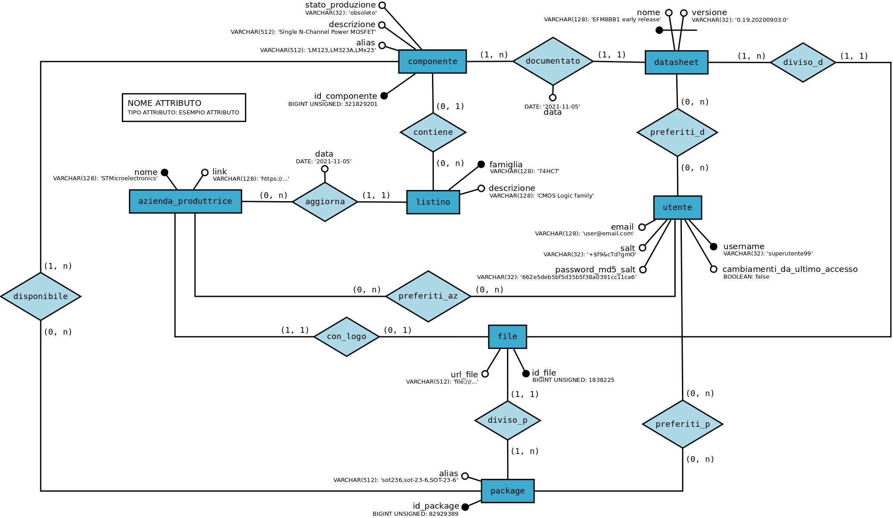

# Datasheet Search

Datasheet Search è un'applicazione web sviluppata per l'anno V 2022/2023. Seguendo il pattern MVC (Model View Controller), la web app finale è in grado di:
+ Comporre pagine dinamicamente partendo da controller (`index.php`, `ajax.php`)
+ Permettere agli utilizzatori di registrarsi come utenti, con verifiche sulla preesistenza di nomi utente, indirizzi mail e della qualità delle password inserite
+ Permettere agli utenti registrati di effettuare il login e logout
+ ... WORK IN PROGRESS ...

Il concetto base della web app è di <u>fornire informazioni relative a componenti elettronici in modo rapido tramite una barra di ricerca ed un raccoglimento dei risultati ben definito.</u> La funzionalità di ricerca potrebbe richiedere l'implementazione di uno stemmer e dell'algoritmo di TF-IDF.

### Autenticazione
Gli utenti sono salvati in un database come una tupla di:
+ Nome utente (`username`)
+ Indirizzo mail (`email`)
+ Hash MD5 della concatenazione della password ed una stringa di salt (`password_md5_salt`)
+ Stringa di salt (`salt`)
+ Un indicatore di nuove notifiche per l'utente (`cambiamenti_da_ultimo_accesso`)

Il login degli utenti consiste in due query SELECT prima per ricevere il salt e poi, dopo aver calcolato l'hash MD5 della password inviata dall'utente concatenata al salt, per confrontare l'hash salvata nel database con quella calcolata.

Nonostante salted MD5 sia un metodo insicuro di preservare i dati di autenticazione degli utenti, in questa web app si implementa a solo scopo didattico. Un metodo interessante oltre che più sicuro consiste nella libreria bcrypt, ampiamente utilizzata.

### Base di dati
Il seguente è lo schema ER della base di dati allo stato più recente:

La base di dati è stata sviluppata per l'utilizzo su MySQL/MariaDB (versione non verificata).

La base di dati include le seguenti tabelle:
+ Tabelle senza chiavi esterne
    + `utente`, la tabella contenente le informazioni degli utenti per l'autenticazione
    + `package`, comprendente i diversi formati fisici di circuiti integrati
+ Tabelle con chiavi esterne
    + `azienda_produttrice`, che include le aziende produttrici di IC
    + `listino`, che descrive il nome della famiglia alla quale appartengono un gruppo di IC, solitamente con nome e specifiche simili
    + `componente`, tabella indicativa di un singolo IC
    + `datasheet`, che include i riferimenti ad ogni singolo documento, la sua versione e la sua appartenenza ad un componente (chiave primaria composta)
    + `file`, <b style='color:red'>da rimuovere e convertire in attributo (indirizzo file o id tramite controller)</b>
+ Tabelle da associazioni molti a molti
    + `preferiti_d`, `preferiti_az`, `preferiti_p`, rispettivamente i datasheet, aziende e package preferiti dagli utenti

Il database presenta un anello nella sua costruzione finale, che è completato utilizzando una query ALTER TABLE.

### Tailwind CSS
Lo stile grafico utilizzato dall'intera web app si basa completamente sulle funzionalità fornite da [Tailwind CSS](https://tailwindcss.com/), che implementa lo stile degli elementi HTML tramite l'uso di classi prestabilite.

Nella web app ogni pagina costruita da `index.php` contiene il tag script necessario per avviare la libreria utilizzando la sua versione JS. Lo script è collocato in `view/using/tailwindcss-script.html`. La versione finale della web app utilizzerà un metodo adeguato per inserire la libreria.

### Rafforzamento sicurezza
La web app utilizza procedure standard per la sicurezza, tra cui:
+ Utilizzo di controller per l'accesso indiretto alle risorse (accesso diretto disabilitato dal web server)
+ MD5 Rainbow Tables: salt applicato alle password
+ PHP Code Injection: `htmlspecialchars()`, `filter_var()`
+ PHP Timing Attack: `hash_equals()`
+ SQL Injection: `mysqli_real_escape_string()`

Al completamento della web app sarà possibile procedere con un penetration test per cercare di trovare vulnerabilità.

### AJAX
La web app implementa un controller lato server per le richieste AJAX (`ajax.php`) che è in grado di contattare altre procedure internamente (`model/ajax`). 
Dal lato client nelle pagine in cui AJAX viene utilizzato sono inclusi gli script (`view/ajax`) che forniscono le funzionalità richieste tramite `XMLHttpRequest()`.
